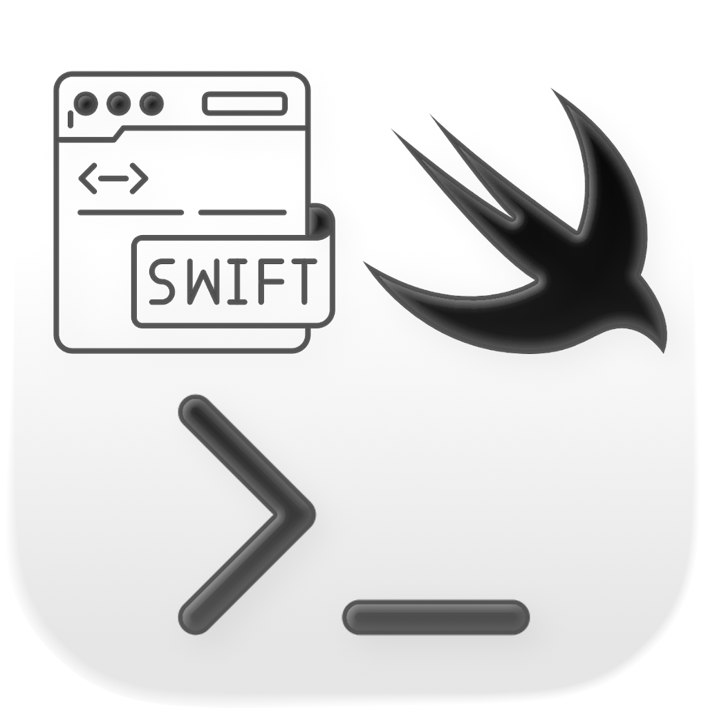

# NovaSwift

Native macOS integrated development environment (IDE) specifically built for writing and executing Swift and Kotlin scripts with high performance and a modern user interface.

1. Editor pane and output pane.
2. Write script to a file and run it using `/usr/bin/env swift` or `kotlinc -script`.
3. Support for long-running and **interactive** scripts.
4. Live, **unbuffered** output of the script as it executes.
5. Display of errors and execution failures with **enhanced navigation**.
6. Intelligent status bar indicating "Ready", "Running...", or "Awaiting for user input".
7. System notifications when scripts require your attention.
8. Indication of non-zero exit codes.
9. Syntax highlighting for keywords, types, strings, and comments.
10. Clickable error locations to navigate to code across different files.



## Features

NovaSwift provides a streamlined experience for script development on macOS:

### Core Functionality
*   **Multi-Language Support:** Write and execute **Swift** (`.swift`) and **Kotlin** (`.kts`) scripts seamlessly.
*   **Interactive Scripts:** Support for standard input (`stdin`). A dedicated input field appears automatically when a script is waiting for your input.
*   **Unbuffered Real-time Output:** Child processes run with `NSUnbufferedIO` enabled, ensuring that prompts and log messages appear instantly.
*   **System Notifications:** Receive macOS desktop notifications when a script is waiting for input, even if the app is in the background.

### Project Management
*   **File Explorer:** Integrated sidebar to browse your project folder.
*   **File Operations:** **Create**, **Rename**, and **Delete** files directly from the sidebar context menu.
*   **Language Recognition:** Specific icons for Swift and Kotlin files for easy identification.

### Editor & UI
*   **Syntax Highlighting:** Native, performant syntax highlighting for keywords, types, strings, and comments.
*   **Enhanced Error Navigation:** Click on any error in the console (e.g., `main.swift:10:5`) to jump directly to that line.
*   **Customizable Editor:** Adjust **Font Size** dynamically (`Cmd +`, `Cmd -`) or via Settings.
*   **Theme Support:** Choose between **Light** and **Dark** modes in Settings.
*   **Sharing:** Share your script output logs directly via the system share sheet (AirDrop, Messages, etc.).

### Configuration
*   **Custom Executables:** Manually specify paths for `swift` and `kotlinc` in Settings if they are not in standard locations.
*   **Notification Management:** Manage notification permissions directly from the app.

## Keyboard Shortcuts

Boost your productivity with these built-in shortcuts:

| Action | Shortcut | Description |
| :--- | :---: | :--- |
| **Run Script** | `Cmd + R` (⌘R) | Compiles and executes the currently open script. |
| **Save File** | `Cmd + S` (⌘S) | Saves the current changes to the open file. |
| **Increase Font** | `Cmd + +` | Increases the editor font size. |
| **Decrease Font** | `Cmd + -` | Decreases the editor font size. |

## Getting Started

### Prerequisites

*   **Swift:** Pre-installed on macOS.
*   **Kotlin:** To run Kotlin scripts (`.kts`), you must have the Kotlin compiler installed.
    ```bash
    brew install kotlin
    ```

### Notifications

NovaSwift uses system notifications to alert you when a script needs input. You can manage notification permissions directly in the **Settings** window within the app.

---

### Running the Application

You can run NovaSwift either using Xcode (recommended for development) or directly from the terminal.

**Option 1: Using Xcode**
1. Open the project file `NovaSwift.xcodeproj`.
2. Ensure the `NovaSwift` scheme is selected.
3. Select your Mac as the destination.
4. Press **Command + R** (⌘R) to run.

**Option 2: Using Terminal**
To build and run the application from the command line:

1. Build the application:
   ```bash
   xcodebuild -scheme NovaSwift -destination 'platform=macOS' build
   ```
2. Open the application bundle:
   ```bash
   open $(xcodebuild -scheme NovaSwift -destination 'platform=macOS' -showBuildSettings | grep -m 1 "TARGET_BUILD_DIR" | cut -d "=" -f 2 | xargs)/NovaSwift.app
   ```

---

### Running Tests

NovaSwift includes a suite of unit tests for its core services (`ScriptExecutor`, `ProjectManager`) and models.

**Option 1: From Xcode**
Press **Command + U** (⌘U) to build and run all tests.

**Option 2: From Terminal**
```bash
xcodebuild test -scheme NovaSwift -destination 'platform=macOS'
```

---

## Test Scripts

The repository includes several sample scripts in `TestScripts/` to verify IDE functionality manually:

1. `TestScripts/Swift/InputTest.swift`: Verifies interactive input (`stdin`) and notifications.
2. `TestScripts/Swift/Medium.swift`: Tests filesystem permissions and Codable.
3. `TestScripts/Swift/Hard.swift`: Tests concurrency (background threads) and unbuffered UI updates.
4. `TestScripts/Swift/ErrorCompile.swift`: Verifies syntax highlighting and error clicking.
5. `TestScripts/Swift/ErrorRuntime.swift`: Verifies runtime crash handling and stderr output.
6. `TestScripts/Kotlin/Hello.kts`: Basic Kotlin execution test.
7. `TestScripts/Kotlin/InputTest.kts`: Kotlin interaction and `readln()` support.
8. `TestScripts/Kotlin/FileIO.kts`: Kotlin file I/O permissions test.
